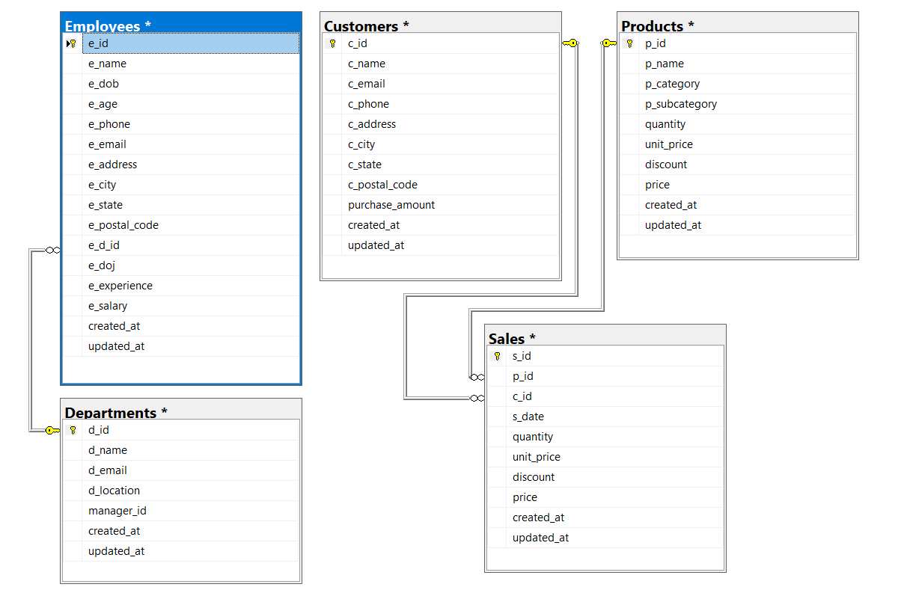
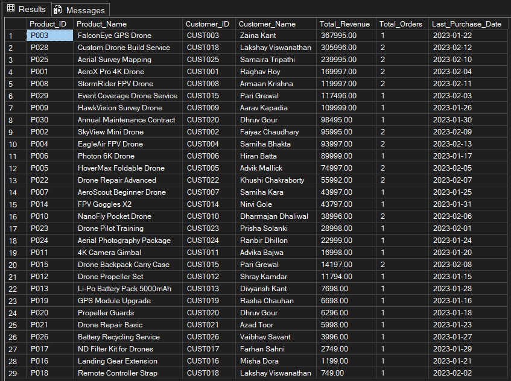
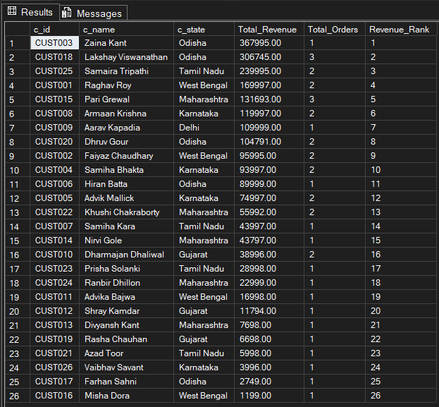

<!DOCTYPE html>
<html lang="en">
<head>
<meta charset="UTF-8">
<meta name="viewport" content="width=device-width, initial-scale=1.0">

</head>
<body>

<h1>Xeta Squad Ltd – Sales and Employees Data Analysis</h1>

An end-to-end SQL Server project demonstrating database design, analytics, and reporting.

<h2> Overview</h2>

This project analyzes sales and Employees data for <strong>Xeta Squad Ltd</strong>, a drone manufacturing and services company. It demonstrates <em>database design</em>, <em>data manipulation</em>, <em>advanced SQL queries</em> in Microsoft SQL Server.

<h2>Database Design</h2>
<ul>
<li>Five core tables: <code>Employees</code>, <code>Departments</code>, <code>Products</code>, <code>Customers</code>, <code>Sales</code>.</li>
<li>Primary and foreign keys ensure referential integrity.</li>
<li>ER-Diagram:</li>
  
</ul>

<h2> Features</h2>
<ul>
<li>Realistic sample data for employees, customers, products, and sales.</li>
<li>Analytics for finding revenue insigts. </li>
<li>Analytical queries: aggregations, joins, subqueries.</li>
</ul>

<h2>Insights & Reports</h2>
<ul>
<li>Top revenue-generating products.</li>
  
<li>Top customer analysis by state.</li>
  
<!-- <li>Highest-paid employees and department comparisons.</li>
  
<li>Monthly revenue trends for decision support.</li>
   -->
</ul>

<h2> Folder Structure</h2>
<pre>
Xeta_Squad_Ltd_Project/
├─ README.html
├─ Database/
│ ├─ create_database.sql
│ ├─ insert_data.sql
│ └─ data_analysis-1.sql
│ 
├─ Reports/
│ ├─ revenue_report.png
│ └─ top_customers.png
│  
└─ Documentation/
  ├─ ER_Diagram.png
  └─ Project_Report.pdf

</pre>

<h2> Getting Started</h2>
<ol>
<li>Clone this repository.</li>
<li>Open Microsoft SQL Server Management Studio (SSMS).</li>
<li>Run <code>create_database.sql</code> to create tables and relationships.</li>
<li>Execute <code>insert_data.sql</code> to populate sample data.</li>
<li>Run <code>analysis_queries.sql</code> for analytics and reporting queries.</li>
</ol>

</body>

</html>

