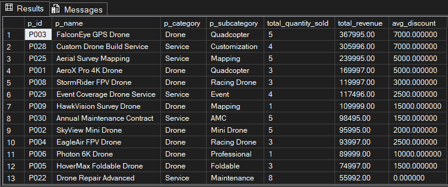
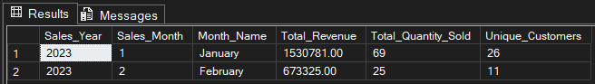
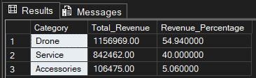

<!DOCTYPE html>
<h1>
<b>SQL-Based Business Insights for Drone Sales and Services</b>
</h1>

<h2>🎯 Project Objective</h2>
<par>
The objective of this project is to analyze the sales performance of Xeta Squad Ltd, a drone manufacturing and service company, using SQL Server. The project focuses on transforming raw transactional data into meaningful business insights by generating key reports such as Revenue Analysis, Top Customer Analysis, and Sales Performance Reports.
</par>
<h4>Through this analysis, the goal is to:</h4>
<ul>
  <li>Identify top-performing products, customers, and regions</li>
  <li>Evaluate overall revenue trends and growth patterns</li>
  <li>Support strategic decision-making for sales optimization and business expansion</li>
</ul>

<h2>🗄 Database Design</h2>
<ul>
<li>Normalized Tables: Designed separate tables for <code>Employees</code>, <code>Departments</code>, <code>Customers</code>, <code>Products</code>, <code>Sales </code> to reduce redundancy and maintain data integrity.</li>
<li>Primary & Foreign Keys: Established primary keys for each table and foreign key relationships to connect customers, sales, and products for efficient querying.</li>
<li>Optimized for Analysis: Structured tables to allow easy aggregation and reporting, enabling creation of Revenue Reports, Top Customer Analysis, and Product Performance Insights.</li>
</ul>
<h3><i><b>ER Diagram</b></i></h3>

<h2>📊 Features</h2>
<ul>
<li>Comprehensive Sales Insights: Generates detailed reports on revenue, top customers, product performance, and regional sales trends.</li>
<li>Data-Driven Decision Support: Helps the company identify high-value customers, top-selling products, and peak sales periods for strategic planning. </li>
<li>SQL-Based Analysis: Uses SQL queries to extract, aggregate, and analyze business data efficiently, demonstrating hands-on data analytics skills.</li>
</ul>

<h2>📈 Insights & Reports</h2>

<h3><i><b>Revenue Reports</b></i></h3>
<par>Summarizes the total revenue generated from drone sales, accessories, and services, highlighting overall business performance and trends.</par>

  
<h3><i><b>Top Customers Sales Analysis</b></i></h3>
<par>Identifies the highest-spending customers and their contribution to total revenue, helping prioritize key accounts and relationships.</par>

<h3><i><b>Product Performance Analysis</b></i></h3>
<par>Shows the sales performance of individual drone models and accessories, highlighting top-selling and underperforming products.</par>

<h3><i><b>Region-wise Sales Analysis</b></i></h3>
<par>Breaks down sales by region or city to identify high-performing areas and potential markets for business expansion.</par>

<h3><i><b>Monthly Sales Trend</b></i></h3>
<par>Tracks sales over months/quarters to reveal peak periods and seasonal trends for better business planning.</par>

<h3><i><b>Customer Segmentation</b></i></h3>
<par>Groups customers based on total purchases to identify high-value clients and inform targeted marketing strategies.</par>

<h3><i><b>Service vs Product Revenue Report</b></i></h3>
<par>Groups customers based on total purchases to identify high-value clients and inform targeted marketing strategies.</par>

<h2>📂 Folder Structure</h2>
<pre>
SQL-Based Business Insights for Drone Sales and Services/
├─ README.md
├─ create_database.sql
├─ analysis_queries.sql
├─ views_triggers.sql
├─ Product_Performance_Analysis.png
├─ Region_wise_sales_Report.png
├─ Top_Customers_Analysis.png
├─ Region_wise_sales_Report.png
├─ Monthly_Sales_Trend.png
├─ Customer_Segmentation.png
├─ Service_VS_Product_Revenue.png
├─ Top_Customers_Analysis.png
└─ ER_Diagram.png
</pre>

<h2>🚀 Getting Started</h2>
<ol>
<li>Clone this repository.</li>
<li>Open Microsoft SQL Server Management Studio (SSMS).</li>
<li>Run <code>create_database.sql</code> to create tables and relationships.</li>
<li>Execute <code>insert_data.sql</code> to populate sample data.</li>
<li>Run <code>analysis_queries.sql</code> for analytics and reporting queries.</li>
</ol>

</body>

</html>

